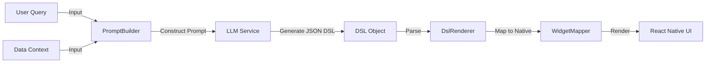

# Generative UI 系统架构与实现机制

本文档详细说明了本项目中 Generative UI (GenUI) 系统的核心架构、数据链路及渲染机制。

## 1. 核心链路 (Data Flow)

整个系统遵循 **"Prompt as Compiler"** (Prompt 即编译器) 的设计理念。

- **User Query**: 用户输入的自然语言指令（如："帮我生成一个周杰伦的卡片"）。
- **Data Context**: 业务数据源（JSON），包含实际要展示的数据。**这不是 AI 生成的**，而是由客户端调用业务 API 获取后，作为上下文提供给 AI 的。
- **Result (DSL)**: AI 生成的中间产物，是符合我们预定义的 Schema 的 JSON 数据，而非直接的代码或图片。

## 2. Prompt 工程设计 (Prompt Engineering)

Prompt 工程集中在 `src/ai/PromptBuilder.ts` 中，负责将“原材料”组装成 AI 可理解的指令。

主要包含四个部分：

1.  **Role (角色定义)**: 设定 AI 为 "Expert UI Generator"。
2.  **Component Library (组件库注入)**: 将 `ComponentSchema.ts` 中的 TypeScript 定义注入 Prompt。
    - _作用_：相当于给 AI 一份 API 文档，明确告诉它只能使用 `Column`, `Row`, `Card`, `Text`, `Image` 等组件，以及它们支持的属性（如蛇形命名 `background_color`）。
3.  **Context (上下文注入)**: 动态填入用户的 Query 和 Data JSON。
4.  **Constraints (约束条件)**: 强制要求输出纯净的 JSON 格式，禁止输出 Markdown 代码块。

## 3. 递归渲染机制 (Recursive Rendering)

前端渲染引擎不依赖 `eval` 或即时编译，而是通过递归遍历 DSL 树来构建原生组件列表。

**实现逻辑** (`src/dsl/DslRenderer.tsx`):

1.  **节点识别**: `renderComponent` 函数接收一个 DSL 节点对象。
2.  **属性解析**: 将 DSL 中的蛇形属性（如 `background_color`）传递给 Mapper。
3.  **递归遍历 (Recursion)**:
    - 检查当前节点是否有 `children` 数组。
    - 如果有，对数组中的每个子节点**递归调用** `renderComponent`。
    - 这一过程会一直进行，直到遇到叶子节点（如 `Text`, `Image`）。
4.  **组件构建**: 携带递归生成的子组件树，调用 `WidgetMapper` 生成最终的 React Node。

## 4. 自适应与响应式 (Adaptive & Responsive)

生成的 UI 并非静态图片，而是完全原生的 React Native 组件，因此继承了 Native 的所有响应式特性：

- **尺寸自适应**:
  - 基于 **Flexbox** 布局。
  - `Column`/`Row` 容器默认根据内容撑开 (Main Axis) 或填充父容器 (Cross Axis)。
  - `Image` 组件支持 `width: "100%"` (代码逻辑映射)，可随容器宽度自动缩放。
- **内容自适应**:
  - `Text` 组件支持自动换行和多行显示。数据变多时，卡片高度会自动增加。
- **布局弹性**:
  - 通过 Schema 中的 `main_axis_alignment` (如 `space-between`)，组件能自动适配不同宽度的屏幕并在其间分配间距。

## 总结

该系统实现了一个闭环的 **Server-Driven UI (SDUI)** 变体：

- **AI** 充当了“实时设计师”和“布局引擎”。
- **Native App** 充当了“傻瓜式渲染器”，只负责忠实地将 JSON 转换为像素。
- **数据** 与 **样式** 是分离的，但通过 Prompt 在生成时融合在了一起。
