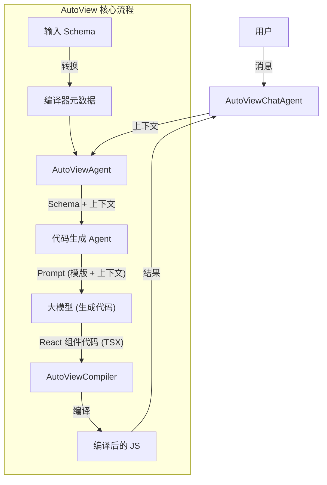
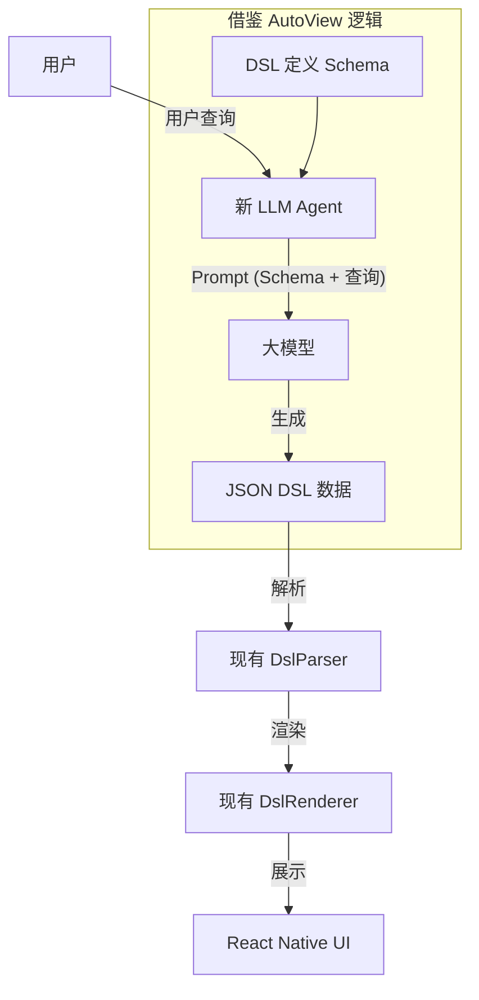

# AutoView 工程分析与迁移可行性总结

## 1. 任务背景
用户希望分析 `/Users/wurongquan/autoview/` 工程的主要 Pipeline，并评估是否可以将其中的 "LLM 到 JSON Scheme" 步骤嫁接到当前 React Native 工程 (`card-style-genui-rn`)，以实现大模型驱动的 UI 渲染。

## 2. AutoView 工程分析

经过对 `autoview` 源码的深入分析，我们得出以下结论：

### 2.1 核心逻辑
`autoview` 的核心并不是生成 JSON Scheme，而是**直接生成代码**。
*   **输入**: 用户查询 (Context) + 预定义的业务数据 Schema。
*   **处理**: 大模型 (LLM) 接收 Schema 定义和用户需求，生成对应的 **React 组件代码 (.tsx)**。
*   **输出**: 编译后的 JavaScript 代码，在 Web 端渲染。

### 2.2 流程图 (Pipeline)

## 3. 迁移可行性分析

### 3.1 误区澄清
用户提到的 "从 LLM 到 JSON Scheme" 步骤在 `autoview` 中并不存在（或者是对 "Schema 输入" 的误解）。`autoview` 是 "Schema 输入 -> LLM -> 代码输出"。

### 3.2 直接嫁接 (不可行)
*   **平台不兼容**: `autoview` 生成的是 Web 端 React 代码 (HTML 标签, Tailwind CSS)，无法直接在 React Native 中运行。
*   **运行时限制**: React Native (尤其是 Hermes 引擎) 不支持动态编译和执行代码 (如 `eval`)，因此无法直接运行 LLM 生成的代码。

### 3.3 逻辑复用 (非常可行)
虽然代码不能直接用，但 **Prompt Engineering 的思想** 可以完美复用。我们可以用“生成 DSL 数据”来替代“生成代码”。

**推荐方案：**
1.  **保留现有渲染器**: 继续使用当前工程中成熟的 `DslParser` 和 `DslRenderer`。
2.  **借鉴 AutoView 思想**:
    *   **Schema 定义**: 将当前的 UI DSL (Column, Row, WeatherCard 等) 定义为 Schema。
    *   **Prompt 构建**: 参考 `autoview` 的 Prompt，将 DSL Schema 和用户查询传给大模型。
    *   **指令修改**: 指示大模型输出 **JSON 格式的 DSL 数据**，而不是 React 代码。

## 4. 新方案架构图

这是结合了 `autoview` 的大模型驱动思想与当前工程渲染能力的最佳实践方案：

## 5. 结论
*   **AutoView 的代码**：不适合直接迁移到 RN。
*   **AutoView 的逻辑**：非常适合。通过让 LLM 生成 JSON DSL，可以实现灵活的“大模型驱动 UI”，同时规避了移动端动态执行代码的风险。
